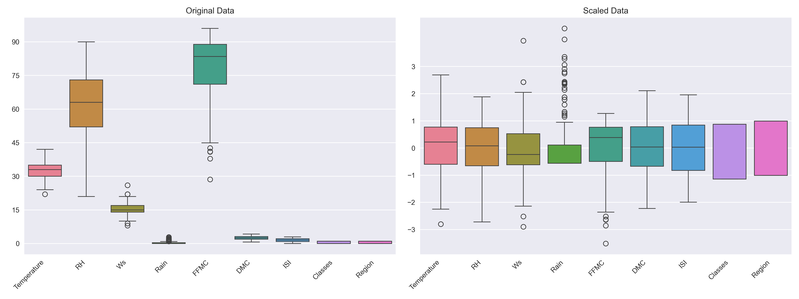
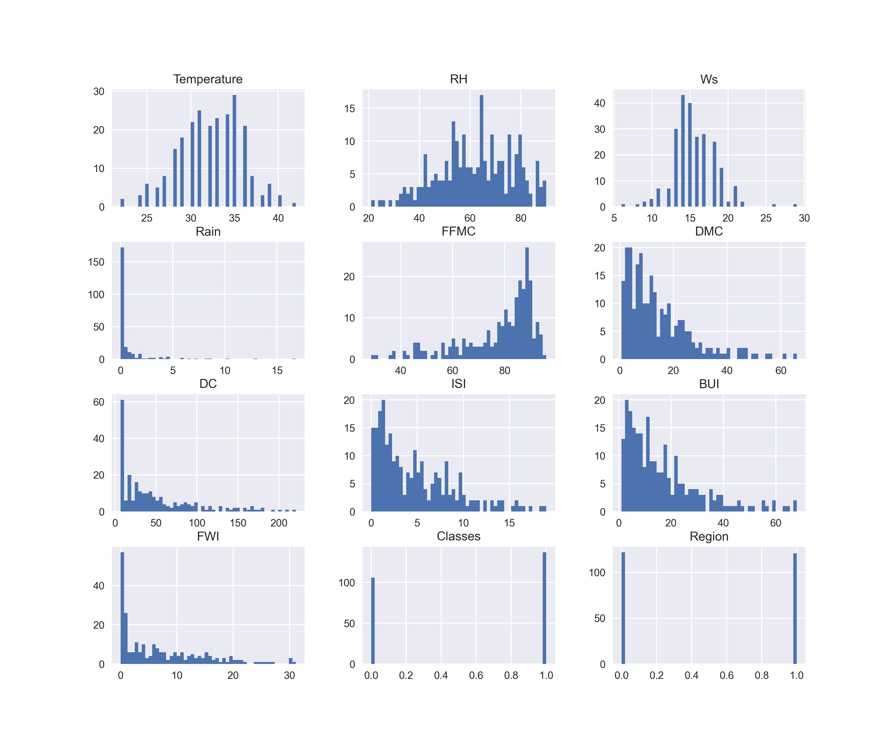
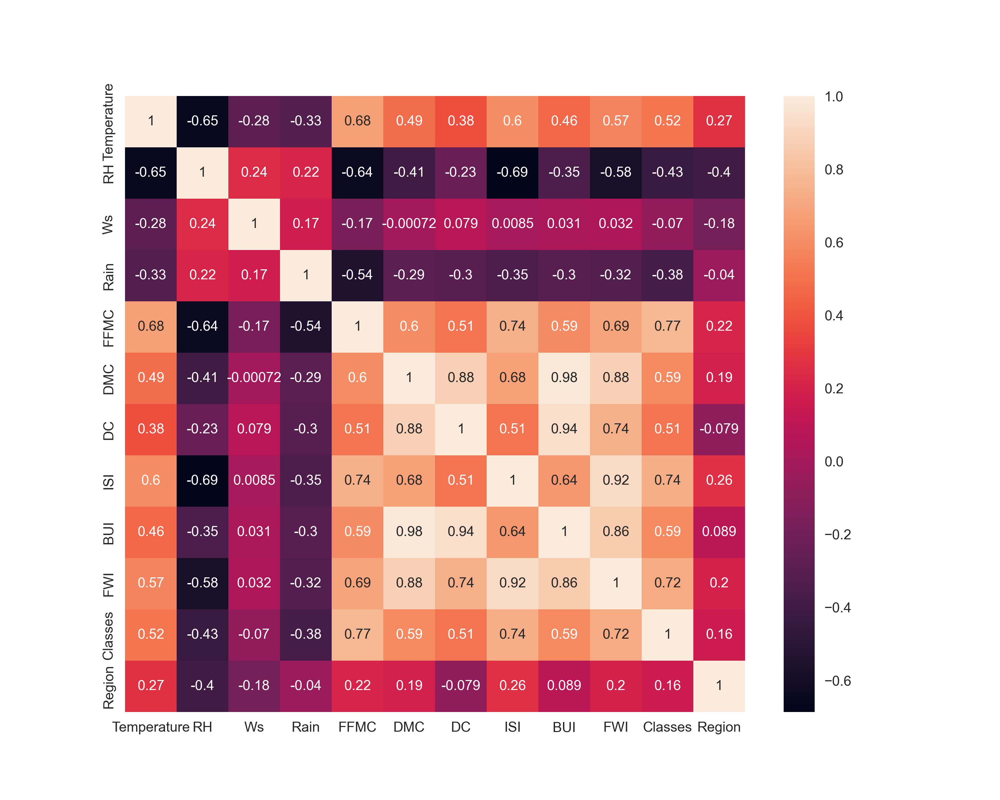
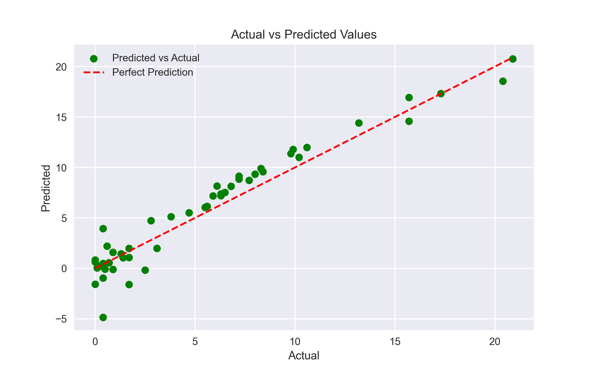
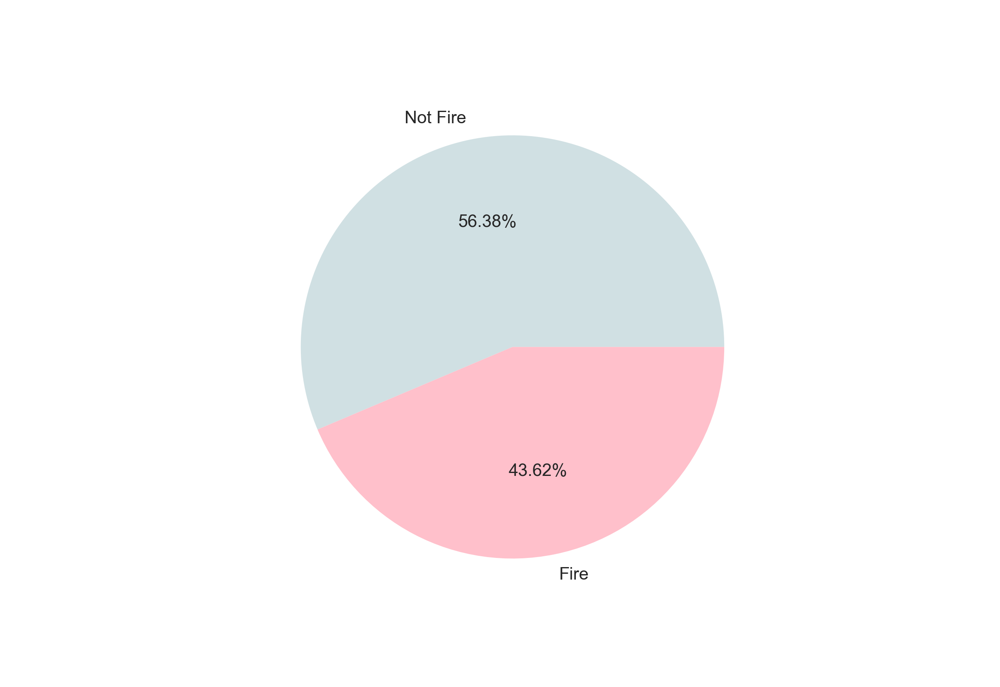

# 🔥 Algerian Forest Fire Prediction using Regression

## About Dataset

The dataset includes 244 instances that regroup a data of two regions of Algeria, namely the Bejaia region located in the northeast of Algeria and the Sidi Bel-abbes region located in the northwest of Algeria.

122 instances for each region.

- The period from June 2012 to September 2012.
- The dataset includes 11 attributes and 1 output attribute (class)
- The 244 instances have been classified into fire (138 classes) and not fire (106 classes) classes.

## Why Use FWI as the Target?

1. Holistic Fire Risk Measurement
    It combines weather conditions—temperature, humidity, wind, precipitation—and fuel moisture into a single numeric index representing fire intensity and spread potential 

2. Continuous Regression Value
- Provides more nuance than a binary “fire/no-fire” classification.
- Enables modeling of fire intensity rather than just presence.

3. Strong Correlation with Fire Events
- FWI serves as a better proxy for actual fire occurrence since it correlates highly with the binary Classes label 
- As seen in similar projects, predicting FWI offers deeper insight into fire dynamics and stronger regression performance.

4. Interpretable & Actionable
- Fire management authorities frequently use FWI for early warning and resource allocation.
- Predicting its value helps assess real-world fire risk.

---

## 📈 Data Exploration and Visualizations

### 📦 Boxplot Before and After Standard Scaling

### 📊 Distribution of Numerical Features (Histogram)

### 🔥 Correlation Heatmap

### 📉 Actual vs Predicted Values Plot

### 🔥🔥 Fire vs No-Fire Pie Chart

---